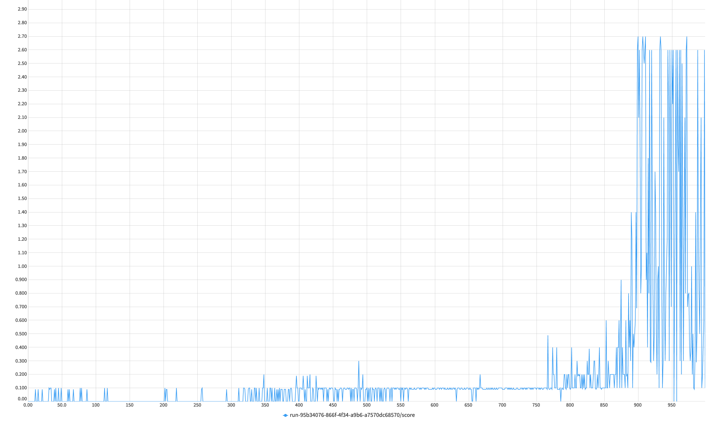
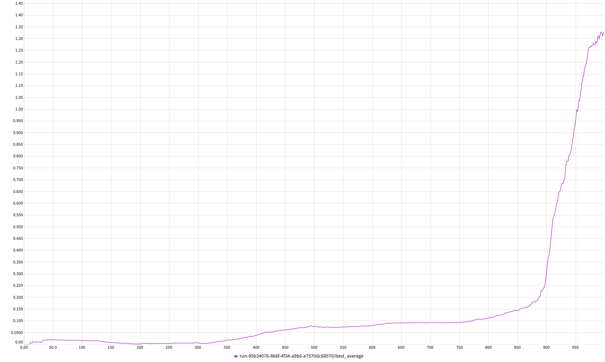

# rl-collaborative-agents

This repository is a solution to problem posed in RL nanodegree - controlling a pair of agents to pass a ball in a 
game of table tennis.
The details of the problem are in the [nanodegree repository](https://github.com/udacity/deep-reinforcement-learning)
in the [p3 navigation folder](https://github.com/udacity/deep-reinforcement-learning/tree/master/p3_collab-compet)

## Problem description
The problem is implemented in a Unity environment. 
The aims is to control two agents to pass a ball between each other without letting it fall to the ground

The gif below shows how a pair of trained agents looks like


### Action range
The agent is controlled by 2 *continous* variables, which corresponds to position of the racket.

### Rewards
The agent gets a reward of `+0.1` for hitting a ball over the net. If the ball falls out of bounds or hits the
ground, the reward received is `-0.01`


### State Space
The agent doesn't observe the environment directly (that is, by using observing the raw pixel data).
Instead, every state (so, every position in the environment) provides data about the agents' environment in a form of
24 continuous variables.   
It is worth noting that the state vector consists of two such vectors, each representing the state vector for one agent.

### Objective
The overall goal of the project is to achieve an *average score of +0.5 over 100 consecutive episodes*. In case of this 
repository, the final result is achieved after 910 epochs

## Learning Process 
The learning process was monitored using the neptune.ai service, with details regarding the final experiment provided 
under [this link](https://app.neptune.ai/wsz/RL-Tenis/e/RLTEN-150/charts). 

The plot showing average rewards from the learning process can be seen below. The whole process was ran for 1000
epochs, although the average of +0.5 was reached after ca. 910 epochs with rapid increase afterwards.

As shown on the plot, the agent lacks stability -
despite quite good results, a very small rewards are sometimes encountered in the learning process. This work van be 
developed further by trying to achieve more stable learning process.



The plot below shows the average score for the agent through epochs.



The method used to train the agent is a MADDPG.

The main inspiration behind the provided solution is the original [paper](https://arxiv.org/abs/1706.02275)
introducing the MADDPG learning architecture. The final architecture of a neural network is slightly changed, due to 
different input types (raw pixels in the paper and a simpler vector data in this problem). 

The original DDPG paper, which serves as a building block for MADDPG uses noise to perform exploration in the environment.
In my experiments I actually didn't use it, as I could solve the environment without it - it could be however examined 
how the process can be improved with the noise, perhaps to accelerate the training process.

### Running the example
To run the example, it is necessary to have a banana unity environment in a path determined in the `src/config/config.json` file.

To download the unity environment, follow one of the three links provided below:

* Linux: [clickhere](https://s3-us-west-1.amazonaws.com/udacity-drlnd/P3/Tennis/Tennis_Linux.zip)
* Mac OSX: [click here](https://s3-us-west-1.amazonaws.com/udacity-drlnd/P3/Tennis/Tennis.app.zip)
* Windows (32-bit): [click here](https://s3-us-west-1.amazonaws.com/udacity-drlnd/P3/Tennis/Tennis_Windows_x86.zip)
* Windows (64-bit): [click here](https://s3-us-west-1.amazonaws.com/udacity-drlnd/P3/Tennis/Tennis_Windows_x86_64.zip)


To setup the packages run the following commands:
```
pip install virtualenv
virtualenv venv
source /venv/bin/activate
pip install -r requirements.txt
```

After this is done, simply run a trained agent with:

`python main.py eval`

or train a new agent with

`python main.py train`